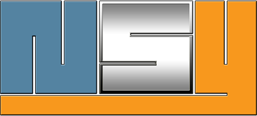

# 🚀 NSY Website - Intelligence Artificielle & Solutions Numériques

[](https://www.nsy.fr)
[](LICENSE)
[](https://github.com/machouse78/nsy-website)

> Site web professionnel pour NSY, ESN spécialisée en Intelligence Artificielle et transformation digitale. 
> Créé avec une approche Apple-style et des animations vidéo immersives.



## ✨ Fonctionnalités Principales

### 🎬 **Vidéo Hero Immersive**
- **3 vidéos aléatoires** : Chargement Math.random() entre video.mp4, video2.mp4, video3.mp4
- Animation vidéo fullscreen style Apple iPhone
- Auto-play au chargement (respect politique navigateurs)
- **Ralentissement progressif** : playbackRate JavaScript dans les 0.5 dernières secondes
- Pas de boucle, arrêt naturel sur dernière frame

### 🎨 **Design Premium Apple-Style**
- **Typographie distinctive** : Playfair Display + Inter (évite générique)
- **Palette minimaliste** : Bleu accent + fond noir pour thème IA
- **Layout asymétrique** : Sections alternées gauche/droite avec numérotation
- **Animations GSAP** : ScrollTrigger + Lenis smooth scroll optimisées

### 🤖 **Intelligence Artificielle Intégrée**
- **Chatbot IA expert** : Réponses contextuelles sur services NSY
- **Base de connaissances** : Technologies, prix, méthodologie, contact
- **Interface moderne** : Toggle fixe + fenêtre backdrop-blur
- **Réponses expertes** : Stack technique détaillé, grilles tarifaires

### 📱 **UX/Navigation Ultra-Optimisée**
- **Navigation ultra-précise** : Buffers différentiels par section (concept: 100px, processus: 250px, etc.)
- **Smooth scroll Lenis** : Transitions fluides entre toutes les sections
- **Responsive design** : Mobile-first avec breakpoints adaptatifs
- **Formulaire contact** : Génération mailto automatique + validation HTML5
- **Modal image** : Zoom briefing.png avec transform-origin calculé depuis position source

### 🎯 **Fonctionnalités Avancées**
- **Bouton "Découvrir"** : Scroll automatique vers section Concept avec buffer identique au menu
- **Sections alternées** : align-left/align-right avec animations slide cohérentes
- **Espacements optimisés** : Distribution serrée et uniforme (12 points par section)
- **Marquees animées** : Texte défilant avec vitesses différentielles
- **Footer intelligent** : Année automatique + mention transparence IA
- **Liens sociaux** : LinkedIn + GitHub avec animations hover et icônes SVG

## 🛠️ Technologies Utilisées

### Frontend Core
- **HTML5** - Structure sémantique moderne
- **CSS3** - Styling avancé avec variables custom + modal système
- **JavaScript ES6+** - Logic native sans frameworks

### Libraries & CDN
- **GSAP 3** + **ScrollTrigger** - Animations professionnelles
- **Lenis** - Smooth scroll premium
- **Fonts Google** - Playfair Display + Inter

### Optimisations
- **Video API native** - playbackRate pour ralentissement progressif
- **Canvas rendering** - Fallbacks si nécessaire  
- **Responsive images** - Optimisation mobile
- **Compression GZIP** - Configuration .htaccess Infomaniak

## 📁 Structure du Projet

```
nsy-website/
├── index.html                  # Page principale (7 sections numérotées)
├── .htaccess                   # Configuration Apache/Infomaniak optimisée
├── robots.txt                  # SEO et indexation
├── css/
│   └── style.css              # Styles complets + responsive + modal
├── js/
│   └── app.js                 # Logic + animations + chatbot + modal
├── public/
│   ├── video.mp4              # Vidéo hero principale (69MB)
│   ├── video2.mp4             # Vidéo alternative 2
│   ├── video3.mp4             # Vidéo alternative 3
│   ├── briefing.png           # Image processus NSY (modal zoom)
│   └── nsy-logo.png           # Logo NSY
├── deploy/                     # Dossier déploiement auto-généré (225MB)
├── .claude/
│   └── skills/                # Skills IA utilisés
├── DEPLOIEMENT-INFOMANIAK.md   # Guide hébergement complet
└── prepare-deploy.sh           # Script préparation automatique
```

## 🎯 Skills IA Appliqués

### 🎨 **frontend-design**
- Interface distinctive évitant les clichés IA génériques
- Compositions asymétriques et typographie caractérielle
- Animations orchestrées et détails atmosphériques
- Couleurs et espacements premium

### 🎬 **video-to-website** 
- Intégration vidéo hero style Apple iPhone/MacBook
- Effets de ralentissement cinématographique
- Optimisation performance et UX vidéo
- Chargement aléatoire multi-vidéos

## 🚀 Installation & Développement

### Prérequis
- Navigateur moderne (Chrome, Firefox, Safari, Edge)
- Serveur local pour développement

### Installation
```bash
# Cloner le repository
git clone https://github.com/machouse78/nsy-website.git
cd nsy-website

# Lancer serveur local
python3 -m http.server 8000
# Ou
npx serve .
# Ou
php -S localhost:8000

# Accéder au site
open http://localhost:8000
```

### Développement
```bash
# Préparer le déploiement
./prepare-deploy.sh

# Contenu à uploader = dossier deploy/ (225MB avec 3 vidéos)
```

## 🌐 Déploiement Infomaniak

### Préparation Automatique
```bash
./prepare-deploy.sh  # Génère le dossier deploy/ complet
```

### Upload FTP
1. Connectez-vous à votre espace Infomaniak
2. Uploadez le contenu de `deploy/` dans `public_html/`
3. Vérifiez que `.htaccess` est bien transféré
4. Vérifiez les 3 vidéos (69MB chacune)

### Post-Déploiement
- ✅ Site accessible sur `https://www.nsy.fr`
- ✅ SSL automatique (Let's Encrypt Infomaniak)
- ✅ Compression GZIP activée
- ✅ Cache headers configurés (1 mois assets, 1 semaine code)

## 📊 Performance & Optimisations

### Métriques Cibles
- **First Contentful Paint** : < 2s
- **Largest Contentful Paint** : < 4s (avec vidéo)
- **Cumulative Layout Shift** : < 0.1
- **Time to Interactive** : < 5s

### Optimisations Appliquées
- **Multi-vidéos** : 3 vidéos 69MB chacune pour variété
- **Cache stratégie** : 1 mois images/vidéos, 1 semaine CSS/JS
- **GZIP compression** : Activée pour tous les text assets
- **Espacement scroll optimisé** : Sections serrées et fluides

## 🎨 Sections & Contenu

### 📄 Structure des Sections
1. **001 / Innovation** - Vidéo hero + tagline + bouton "Découvrir"
2. **002 / Concept** - Notre approche méthodologique
3. **003 / Processus** - 3 étapes clés + image briefing.png (modal)
4. **004 / La Société** - Présentation NSY ESN
5. **005 / Services** - Développement & Innovation IA
6. **006 / Expertise** - Technologies de pointe
7. **007 / Contact** - Formulaire + informations (data-persist)

### 🤖 Chatbot IA Responses
- **Services** : Stack technique + domaines expertise
- **IA/ML** : Technologies + cas d'usage + exemples projets
- **Prix** : Grille tarifaire détaillée + consultations gratuites
- **Contact** : Coordonnées + délais réponse + disponibilités
- **Technologies** : Frontend/Backend/Cloud/DevOps détaillé
- **Méthodologie** : Process 6 étapes + Agile + livrables

## 🔧 Configuration Technique

### Vidéo Settings
```javascript
// 3 vidéos aléatoires au chargement
const videos = ['video.mp4', 'video2.mp4', 'video3.mp4'];
const randomVideo = videos[Math.floor(Math.random() * videos.length)];

// Ralentissement 0.5s avant fin
fadeStartTime = videoDuration - 0.5;
fadeProgress = (currentTime - fadeStartTime) / 0.5;
playbackRate = 1.0 → 0.3 (ralentissement 70%)
```

### Navigation Buffers (Optimisés)
```javascript
buffers = {
    concept: 100px,     // Section Concept (était 300px → 200px → 100px)
    process: 250px,     // Processus  
    about: 200px,       // La Société
    services: 200px,    // Services
    expertise: 100px,   // Expertise (parfait)
    contact: 600px      // Contact (fin de page)
}
```

### Sections Scroll (Espacements Serrés)
```javascript
// Distribution optimisée sur 100% de scroll
sections = {
    concept: '10% → 22%',    // 12 points
    process: '25% → 37%',    // 12 points  
    about: '40% → 52%',      // 12 points
    services: '55% → 67%',   // 12 points
    expertise: '70% → 82%',  // 12 points
    contact: '85% → 100%'    // 15 points (data-persist)
}
```

## 🎯 Corrections & Améliorations Récentes

### ✅ Navigation Optimisée
- **Bouton "Découvrir"** : Utilise même logique que liens menu (buffer 100px)
- **Buffers ajustés** : Concept réduit de 300px → 100px pour meilleur positionnement
- **Espacements serrés** : Distribution uniforme 12 points par section

### ✅ Sections Stabilisées  
- **Numérotation corrigée** : 001 → 007 sans doublons
- **Expertise visible** : Plage étendue 70% → 82% (était 84% → 92%)
- **Contact restaurée** : 85% → 100% (était invisible à 100% → 120%)

### ✅ Fonctionnalités Avancées
- **Modal image briefing** : Transform-origin calculé + clic pour fermer
- **Chatbot expert** : Réponses détaillées sur tous les aspects NSY
- **Formulaire intelligent** : Génération mailto + validation HTML5
- **Footer dynamique** : Année automatique + mention transparence IA

## 🤝 Contribution

Ce projet démontre l'utilisation de skills IA spécialisés pour créer des interfaces web distinctives et performantes.

### Développé par
- **NSY** - [nsy.fr](https://nsy.fr)
- **Cédric Barme** - Expert IA & Développement Full-Stack

### Built with ❤️ and 🤖
Site créé avec l'IA en toute transparence, appliquant les skills `frontend-design` et `video-to-website` pour un résultat premium Apple-style.

---

## 📞 Contact & Réseaux

### 📧 Contact Professionnel
- **Email** : [contact@nsy.fr](mailto:contact@nsy.fr)
- **Website** : [nsy.fr](https://nsy.fr)
- **Expertise** : Intelligence Artificielle & Transformation Digitale
- **Spécialités** : React, Node.js, Python, IA/ML, Cloud AWS/Azure, DevOps

### 🌐 Réseaux Sociaux
- **LinkedIn** : [linkedin.com/in/cedric-barme](https://linkedin.com/in/cédric-barme)
- **GitHub** : [github.com/machouse78/nsy-website](https://github.com/machouse78/nsy-website)
- **Profil** : Expert IA & Développement Full-Stack

---

*© 2024 NSY. Tous droits réservés. | Site créé avec l'IA • Transparence totale*